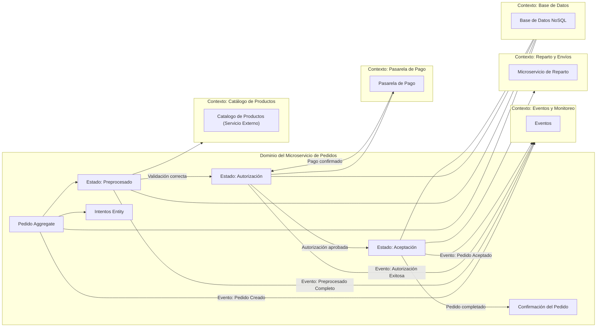

```mermaid
graph LR
    %% Contexto principal
    subgraph Dominio_Pedidos["Dominio del Microservicio de Pedidos"]
        Pedido[Pedido Aggregate]
        Pedido --> Preprocesado["Estado: Preprocesado"]
        Preprocesado -->|Validación correcta| Autorizacion["Estado: Autorización"]
        Autorizacion -->|Autorización aprobada| Aceptacion["Estado: Aceptación"]
        Aceptacion -->|Pedido completado| Confirmacion["Confirmación del Pedido"]
        Pedido --> Intentos[Intentos Entity]
    end

    %%Eventos y Monitoreo
    subgraph Events["Contexto: Eventos y Monitoreo"]
        Eventos
    end

    %% Contextos delimitados
    subgraph CatalogoContexto["Contexto: Catálogo de Productos"]
        Catalogo["Catalogo de Productos (Servicio Externo)"]
    end

    subgraph PagosContexto["Contexto: Pasarela de Pago"]
        Pago["Pasarela de Pago"]
    end

    subgraph RepartoContexto["Contexto: Reparto y Envíos"]
        Reparto["Microservicio de Reparto"]
    end

    subgraph Datos["Contexto: Base de Datos"]
        BDD["Base de Datos NoSQL"]
    end
    
    %% Relaciones externas
    Preprocesado --> CatalogoContexto
    Autorizacion --> Pago
    Aceptacion --> RepartoContexto
    Pago -->|Pago confirmado| Autorizacion
    
    %% Eventos
    Pedido -->|Evento: Pedido Creado| Events
    Preprocesado -->|Evento: Preprocesado Completo| Events
    Autorizacion -->|Evento: Autorización Exitosa| Events
    Aceptacion -->|Evento: Pedido Aceptado| Events

    %% Datos
    Pedido --- Datos
    Preprocesado --- Datos
    Autorizacion --- Datos
    Aceptacion --- Datos
```