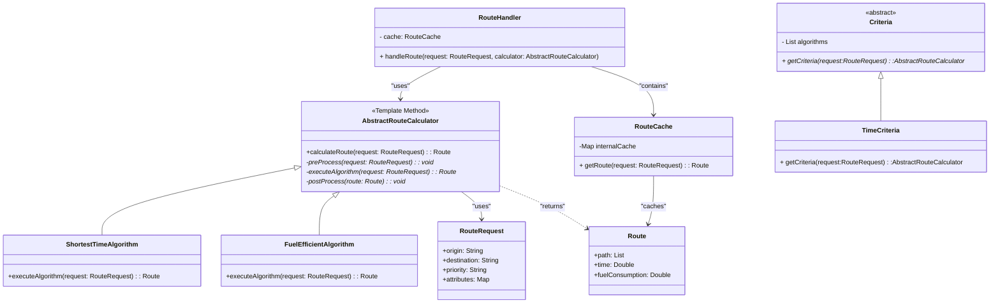

```mermaid
classDiagram
    class AbstractRouteCalculator {
        +calculateRoute(request: RouteRequest): Route
        <<Template Method>>
        -preProcess(request: RouteRequest): void*
        -executeAlgorithm(request: RouteRequest): Route*
        -postProcess(route: Route): void*
    }


    class ShortestTimeAlgorithm {
        +executeAlgorithm(request: RouteRequest): Route
    }


    class FuelEfficientAlgorithm {
        +executeAlgorithm(request: RouteRequest): Route
    }


    class RouteRequest {
        +origin: String
        +destination: String
        +priority: String
        +attributes: Map<String, String>
    }


    class Route {
        +path: List<String>
        +time: Double
        +fuelConsumption: Double
    }


    AbstractRouteCalculator <|-- ShortestTimeAlgorithm
    AbstractRouteCalculator <|-- FuelEfficientAlgorithm
    AbstractRouteCalculator --> RouteRequest : "uses"
    AbstractRouteCalculator ..> Route : "returns"


    class RouteHandler {
        - cache: RouteCache
        + handleRoute(request: RouteRequest, calculator: AbstractRouteCalculator)
    }


    class RouteCache {
        -Map<RouteRequest, Route> internalCache
        + getRoute(request: RouteRequest): Route
    }


    RouteHandler --> AbstractRouteCalculator : "uses"
    RouteHandler --> RouteCache : "contains"
    RouteCache --> Route : "caches"


    class Criteria {
        <<abstract>>
        - List<AbstractRouteCalculator> algorithms
        + getCriteria(request:RouteRequest):AbstractRouteCalculator*
    }


    class TimeCriteria {
        + getCriteria(request:RouteRequest):AbstractRouteCalculator
    }


    Criteria <|-- TimeCriteria

```
