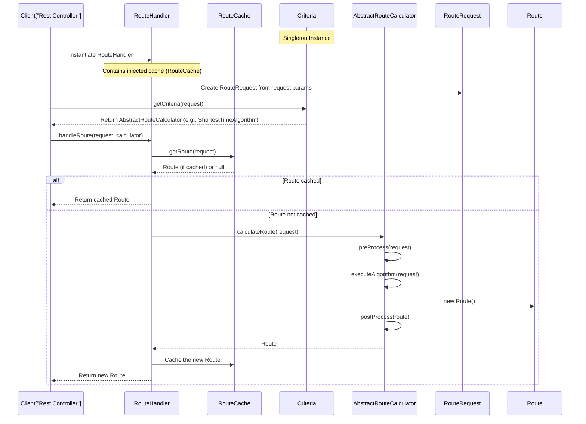

```mermaid
sequenceDiagram
    participant Client["Rest Controller"]
    participant RouteHandler
    participant RouteCache
    participant Criteria
    participant AbstractRouteCalculator
    participant RouteRequest
    participant Route
    Note over Criteria: Singleton Instance
    Client["Rest Controller"]->>RouteHandler: Instantiate RouteHandler
    Note over RouteHandler: Contains injected cache (RouteCache)

    Client["Rest Controller"]->>RouteRequest: Create RouteRequest from request params
    Client["Rest Controller"]->>Criteria: getCriteria(request)
    Criteria-->>Client["Rest Controller"]: Return AbstractRouteCalculator (e.g., ShortestTimeAlgorithm)
    Client["Rest Controller"]->>RouteHandler: handleRoute(request, calculator)

    RouteHandler->>RouteCache: getRoute(request)
    RouteCache-->>RouteHandler: Route (if cached) or null

    alt Route cached
        RouteHandler-->>Client["Rest Controller"]: Return cached Route
    else Route not cached
        RouteHandler->>AbstractRouteCalculator: calculateRoute(request)
        AbstractRouteCalculator->>AbstractRouteCalculator: preProcess(request)
        AbstractRouteCalculator->>AbstractRouteCalculator: executeAlgorithm(request)
        AbstractRouteCalculator->>Route: new Route()
        AbstractRouteCalculator->>AbstractRouteCalculator: postProcess(route)
        AbstractRouteCalculator-->>RouteHandler: Route

        RouteHandler->>RouteCache: Cache the new Route
        RouteHandler-->>Client["Rest Controller"]: Return new Route
    end


```
