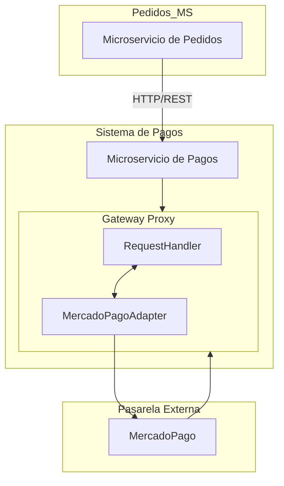

```mermaid
graph TB
    subgraph Pedidos_MS
        Pedidios["Microservicio de Pedidos"]
    end
    Pedidios --HTTP/REST--> Pagos


    subgraph Pagos_MS["Sistema de Pagos"]
        Pagos["Microservicio de Pagos"]
        Gateway
        Pagos --> Gateway
    end


    subgraph Gateway["Gateway Proxy"]
        RequestHandler
        Adapter["MercadoPagoAdapter"]
        RequestHandler <--> Adapter
    end


    subgraph Proveedor_Pagos["Pasarela Externa"]
        MercadoPago
    end


    Adapter --> MercadoPago
    MercadoPago ---> Gateway

```
