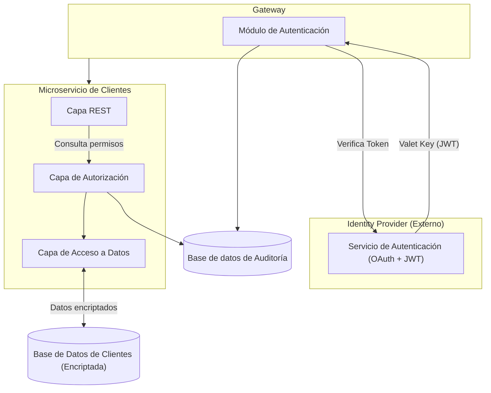

```mermaid
flowchart TD
    subgraph API_Gateway["Gateway"]
        Autenticacion["Módulo de Autenticación"]
    end

    subgraph SecuritySystem["Identity Provider (Externo)"]
        AuthService["Servicio de Autenticación (OAuth + JWT)"]
    end
    AuditService[("Base de datos de Auditoría")]

    subgraph ClientService["Microservicio de Clientes"]
        API["Capa REST"]
        PermissionModule["Capa de Autorización"]
        DataAccess["Capa de Acceso a Datos"]
    end

    API_Gateway --> ClientService
    
    Database[("Base de Datos de Clientes (Encriptada)")]

    %% Flow connections
    AuthService ----> |"Valet Key (JWT)"| Autenticacion
    Autenticacion ----> |"Verifica Token"| AuthService
    API -- "Consulta permisos" --> PermissionModule
    PermissionModule --> DataAccess
    DataAccess <-- "Datos encriptados" --> Database
    PermissionModule --> AuditService
    Autenticacion --> AuditService
```
