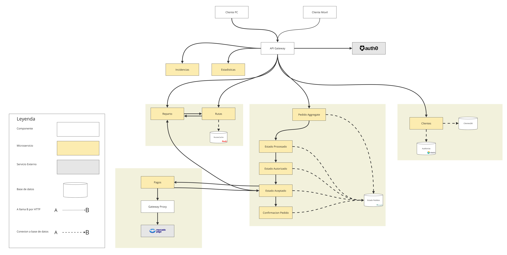

Esta vista muestra cómo interactúan los diferentes microservicios

Esta vista fue generada con Miro y se puede visualizar con mejor detalle en [este enlace](https://miro.com/app/board/uXjVLD5rjlQ=/?share_link_id=523970499998)

## Elementos

### Sistemas Externos

- MercadoPago es el proveedor de pagos, el cual se intregrará mediante el consumo de una API.

- Auth0 es el proveedor de identidad federada, que se encarga de las credenciales de los usuarios, puede integrar inicio de sesión con otros proveedores como Google o Facebook.

### Dominio de Pedidos

El Dominio de Pedidos está compuesto por una máquina de estados, representada por varios microservicios que van a estar conectados de manera que en cada microservicio se procese el pedido según el estado que representa y al finalizar el procesamiento, va a pasar el pedido al siguiente microservicio, siguiendo la cadena de estados.
Utiliza una base de datos MongoDB para almacenar el estado de los pedidos, optimizando la escalabilidad y el rendimiento.

Esta arquitectura está orientada a facilitar la modularidad, el monitoreo y la capacidad de adaptación a un entorno asíncrono.

[ADR-002: Domain-Driven Design con Máquina de Estados para el Sistema de Pedidos](/Architectural-Decision-Records/ADR-002.md)

[Vista del Sistema de Pedidos](/Architectural-Decision-Records/imagenes/ADR-002-ddd-microservicio-pedidos.md)

### Dominio de Clientes

El Dominio de Clientes está compuesto por el microservicio de clientes, que internamente tendrá una arquitectura de capas, y es responsable de auditar y autorizar las solicitudes de datos de clientes. Otro componente es la DB-per-service que contendrá los datos de los clientes. Y finalmente, ElasticSearch como base de datos documental para almacenar las auditorías y facilitar su posterior consulta.

[ADR-005 Sistema de Clientes con IDP externo y Arquitectura de tres capas internas](/Architectural-Decision-Records/ADR-005.md)

[Vista del Sistema de Clientes](/Architectural-Decision-Records/imagenes/ADR-005-microservicio-clientes.md)

### Rutas

### Pagos

## Backlog (consultar)